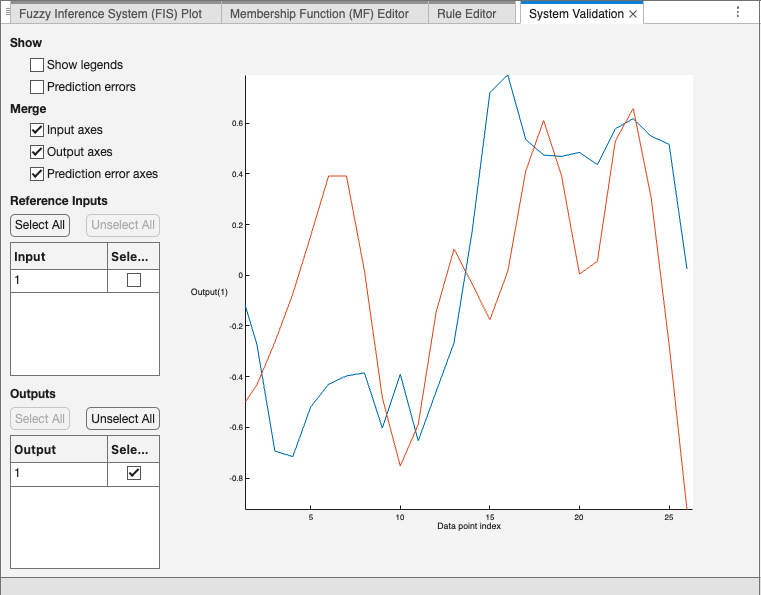

## Fuzzy Logic Toolbox Tutorial

> Let’s quickly review the Week 5 IT Class Material. This week’s task is to create a fuzzy inference system (FIS) for credit evaluation using **Mamdani** and **Sugeno** fuzzy systems.

> In Week 5, we introduced FIS using Python. However, MATLAB provides more robust support for FIS, including user-friendly UI tools. In this tutorial, we’ll explore the MATLAB supports of the FIS.

---

### Matlab Script:

#### 1. Creating the Mamdani FIS

```matlab
fis = mamfis("Name","creditResult");
```

- This line initializes a Mamdani-type fuzzy inference system (FIS) named **“creditResult”**. The Mamdani FIS uses fuzzy rules that map fuzzy inputs to fuzzy outputs, making it a good fit for intuitive decision-making.

#### 2. Adding Inputs to the FIS

```matlab
fis = addInput(fis, [150 200], "Name", "score");
fis = addInput(fis, [0.1 1], "Name", "ratio");
fis = addInput(fis, [0 10], "Name", "credit");
```

- **score**: Ranges from 150 to 200 and represents the credit score.
- **ratio**: Ranges from 0.1 to 1, possibly representing debt-to-income or a similar financial ratio.
- **credit**: Ranges from 0 to 10, likely representing a measure of creditworthiness.

#### 3. Defining Membership Functions (MFs) for Inputs

Membership functions are added to define fuzzy sets for each input. These sets represent linguistic categories like “high” or “good.”

```matlab
fis = addMF(fis,"score","smf",[175 190],"Name","high");
fis = addMF(fis,"score","zmf",[155 175],"Name","low");

fis = addMF(fis,"ratio","zmf",[0.3 0.42],"Name","goodr");
fis = addMF(fis,"ratio","smf",[0.44 0.7],"Name","badr");

fis = addMF(fis,"credit","trapmf",[0 0 2 5],"Name","goodc");
fis = addMF(fis,"credit","trapmf",[5 8 10 10],"Name","badc");
```

- **Membership Functions**:
  - **score**:
    - high: S-shaped (smf) from 175 to 190.
    - low: Z-shaped (zmf) from 155 to 175.
  - **ratio**:
    - goodr: Z-shaped (zmf) from 0.3 to 0.42 (representing a good ratio).
    - badr: S-shaped (smf) from 0.44 to 0.7 (representing a bad ratio).
  - **credit**:
    - goodc: Trapezoidal (trapmf) from 0 to 5, representing good credit.
    - badc: Trapezoidal (trapmf) from 5 to 10, representing bad credit.

#### 4. Adding an Output to the FIS

```matlab
fis = addOutput(fis,[0 10],"Name","decision");
fis = addMF(fis,"decision","trapmf",[5 8 10 10],"Name","Approve");
fis = addMF(fis,"decision","trapmf",[0 0 2 5],"Name","Reject");
```

- **decision**: Output variable ranging from 0 to 10.
  - Approve: Represented by a trapezoidal membership function with parameters [5 8 10 10], indicating approval for higher values.
  - Reject: Represented by a trapezoidal membership function with parameters [0 0 2 5], indicating rejection for lower values.

#### 5. Defining Fuzzy Rules

Fuzzy rules link input conditions to the output decisions. Here, we create three rules for the FIS:

```matlab
rule1 = "score==high & ratio==goodr & credit==goodc => decision=Approve";
rule2 = "score==low & ratio==badr => decision=Reject";
rule3 = "score==low & credit==badc => decision=Reject";
ruleList = [rule1 rule2 rule3];

fis = addRule(fis, ruleList);
```

- **Rules**:
  - **Rule 1**: If score is high, ratio is good, and credit is good, then decision is Approve.
  - **Rule 2**: If score is low and ratio is bad, then decision is Reject.
  - **Rule 3**: If score is low and credit is bad, then decision is Reject.

These rules establish the decision logic for the FIS.

#### 6. Evaluating the FIS with Specific Inputs

To test the FIS, evaluate it with a sample input:

```matlab
evalfis(fis,[190 0.39 1.5]);
```

- This line evaluates the FIS with a set of inputs:

  score = 190, ratio = 0.39, and credit = 1.5.

- `evalfis` will process these inputs through the Mamdani FIS and return the decision based on the defined rules.

#### 7. Converting the FIS to a Sugeno System

```matlab
sugenoFIS = convertToSugeno(fis);
```

- Converts the Mamdani FIS to a Sugeno FIS, which uses crisp output functions instead of fuzzy sets. Sugeno systems are often faster and more suitable for optimization tasks due to their computational efficiency.

#### 8. Generating Surface Plots

Visualize the FIS behavior with surface plots:

```matlab
subplot(2,2,1)
gensurf(fis)
title('Mamdani system (Output 1)')

subplot(2,2,2)
gensurf(sugenoFIS)
title('Sugeno system (Output 1)')
```

- `gensurf` generates 3D surface plots showing how inputs impact the output. The first plot visualizes the Mamdani system, and the second plot visualizes the Sugeno system, allowing for comparison.
- `subplot` arranges the plots in a 2x2 grid, with each plot occupying a quadrant of the figure.

---

### UI Tools:

>  MATLAB also provides graphical tools to create and edit FIS models visually. You can use the **Fuzzy Logic Designer** app to:
>
>  - Design and edit membership functions,
>  - Define rules using a visual interface,
>  - Test the system interactively.
>
>  Please reference the official matlab [documents](https://uk.mathworks.com/help/fuzzy/fuzzylogicdesigner-app.html) for more details. 

> This tutorial walks through creating a fuzzy inference system in MATLAB for credit evaluation. By following these steps, you should be able to implement and test both Mamdani and Sugeno fuzzy systems and gain hands-on experience with fuzzy logic in MATLAB.

- Open **Fuzzy logic Designer** App

  Enter command:

  ```matlab
  fuzzyLogicDesigner
  ```

  Or open it under __Apps__ tab as below:

  

- Edit the FIS system using `Inputs`, `Outputs`, and `Rules` and test it using the given sample

  

  

  

- <u>Try implementing the script example above using the **Fuzzy Logic Designer** GUI tool.</u>


## Train Adaptive Neuro-Fuzzy Inference Systems

> **Neuro-Fuzzy Designer (i.e., ANFIS Editor GUI)** is a tool for designing, training, and testing Sugeno-type fuzzy inference systems. However, it will be removed in a future release (see [details here](https://uk.mathworks.com/help/fuzzy/neurofuzzydesigner-app.html#mw_746f1d4a-749c-46d0-b8d7-9c501b848494)).
>
> So, in this tutorial, we will introduce how to use the **Fuzzy Logic Designer** app (i.e., the GUI tool mentioned above) to train [Adaptive Neuro-Fuzzy Inference Systems](https://uk.mathworks.com/help/fuzzy/train-adaptive-neuro-fuzzy-inference-systems-gui.html). Meanwhile, we will provide the corresponding command lines that implement the same functionality, mainly using the `anfis` command (see [Instruction](https://uk.mathworks.com/help/fuzzy/anfis.html)). For more information, you can also refer to the official documentation: [Neuro-Adaptive Learning and ANFIS](https://uk.mathworks.com/help/fuzzy/neuro-adaptive-learning-and-anfis.html).

---

> **Note:** In this tutorial, we will use three terminologies to describe the data: *training*, *validation*, and *test* data sets, following the definitions provided in [Wikipedia](https://en.wikipedia.org/wiki/Training,_validation,_and_test_data_sets).
>
> - **Training data set**: A set of examples used to fit the parameters (e.g., weights of connections between neurons in artificial neural networks) of the model.
> - **Validation data set**: Provides an unbiased evaluation of a model fit on the training data set while tuning the model’s hyperparameters (e.g., the number of hidden units—layers and layer widths—in a neural network).
> - **Test data set**: A data set used to provide an unbiased evaluation of a *final* model fit on the training data set. If the data in the test data set has never been used during training (e.g., in [cross-validation](https://en.wikipedia.org/wiki/Cross-validation_(statistics))), it is also called a **holdout data set**.
>
> *Note*: The term “validation set” is sometimes used instead of “test set” in some literature, particularly when the original data set is partitioned into only two subsets.

> __In the given case below, *test data set* is not used. __

#### 1. Import Example Data

Import the training data sets to the MATLAB® workspace

```matlab
openExample('fuzzy/TrainAdaptiveNeuroFuzzyInferenceSystemsDataExample')
load anfisTrainingData
```

The data for this example includes two training data sets and two validation data sets.

- Training data set 1 with input data `trnInput1` and output data `trnOutput1`

- Training data set 2 with input data `trnInput2` and output data `trnOutput2`

- Validation data set 1 with input data `valInput1` and output data `valOutput1`

- Validation data set 2 with input data `valInput2` and output data `valOutput2`

  

#### 2. Generate Initial FIS

Open Fuzzy Logic Designer.

```matlab
fuzzyLogicDesigner
```

To create an initial FIS structure based on your training data, in the Getting Started window, select **Generate rules automatically**, and click **FIS from Data**.


In the Create System from Data dialog box:

- In the **Input data** drop-down list, select the training input data `trnInput1`.
- In the **Output data** drop-down list, select the training output data `trnOutput1`.
- In the **Clustering method** drop-down list, select `Grid partition`.
- In the **Input membership function type** drop-down list, select `Generalized bell`.
- To set the number of input membership functions, in the **Number** field, enter `4`.
- In the **Output membership function type** drop-down list, select `Linear`.


Alternatively, use the following commands directly to generate Initial FIS.

```matlab
genOpt = genfisOptions('GridPartition');
genOpt.NumMembershipFunctions = 4;
genOpt.InputMembershipFunctionType = 'gbellmf';
getOpt.OutputMembershipFunctionType = 'linear';
inFIS = genfis(trnInput1,trnOutput1,genOpt);
```

#### 3. Select Data for Training

To select data for tuning, on the **Tuning** tab:

- In the **Input Data** drop-down list, under **Imported Data Sets**, select **trnInput1**.
- In the **Output Data** drop-down list, under **Imported Data Sets**, select **trnOutput1**.


#### 4. Train FIS 

To train your FIS using the selected data, first specify the tuning options. Click **Tuning Options**.

In the Tuning Options dialog box, in the **Method** drop-down list, select `Adaptive neuro-fuzzy inference system`.

To modify the default training options, clear the **Use default method options** parameter.

Under **Method Options: Adaptive neuro-fuzzy inference system**, specify the following options.

- To specify the maximum number of training epochs, set **Epoch number** to `40`.
- Set the error stopping condition **Error goal** to `0`. Doing so indicates that the training does not stop until the maximum number of training epochs complete.
- Use the default training method by setting **Optimization method** to `Least squares estimation with backpropagation`. This method tunes the FIS parameters using a combination of backpropagation and least-squares regression.
- Specify validation data for training. During training, the ANFIS algorithm uses the validation data to prevent overfitting.
  - In the **Input validation data** drop-down list, under **Workspace Data Sets**, select `valInput1`.
  - In the **Output validation data** drop-down list, under **Workspace Data Sets**, select `valOutput1`.
- Keep the remaining training options at their default values.


Click **OK**.

Alternatively, use the `anfisOptions` command to adjust anfis training options.

```matlab
opt = anfisOptions('InitialFIS',inFIS);
opt.EpochNumber = 40;
opt.ErrorGoal = 0;
opt.InitialStepSize = 0.01;
opt.StepSizeDecreaseRate = 0.9;
opt.StepSizeIncreaseRate = 1.1;
opt.DisplayANFISInformation = 1; 
opt.DisplayErrorValues = 1;
opt.DisplayStepSize = 1;
opt.DisplayFinalResults = 1;
opt.ValidationData = [valInput1 valOutput1];
```

To train the FIS, on the **Tuning** tab, click **Tune**. 

Alternatively, the command below implements the same functionality, which integrates with Step 3 Select Data for Training. 

```matlab
% To get more training details, you can use the command below:
[outFIS,trainError,stepSize,chkFIS,chkError] = anfis([trnInput1 trnOutput1],opt);
% Note: `chkFIS` and `chkError` refer to the validated FIS and validation error respectively!

% or just get the trained FIS, you can use the command below: 
% outFIS = anfis([trnInput1 trnOutput1],opt);
```

The **Tune** tab shows the training progress.

- The **Convergence Plot** document plots the optimization cost (training error) after each epoch for both the training and validation data.
- The **Convergence Results** document shows the ANFIS system properties as well as the training error and minimum root mean-squared error results for the training and validation data sets.


The validation error decreases up to a certain point in the training, and then it increases. This increase occurs at the point where the training starts overfitting the training data. The app selects the FIS associated with this overfitting point as the trained ANFIS model.

Alternatively, to visulize the training process, we can use the commands below:

```matlab
% Plot the convergence process
figure;
plot(1:length(trainError), trainError, '-o', 'LineWidth', 1.5); hold on;
plot(1:length(chkError), chkError, '-*', 'LineWidth', 1.5);
grid on;

% Add labels, title, and legend
xlabel('Epoch');
ylabel('Optimisation Cost');
title('Training Convergence');
legend('Training', 'Validation', 'Location', 'Best');

% Optional: Enhance visualization
set(gca, 'FontSize', 12);
hold off;
```

To accept the training results, click **Accept**.

The app adds the tuned FIS `fis_tuned` to the **Design Browser** pane and sets this FIS as the active design.


#### 5. Validate Trained FIS

Once you train your FIS, you can validate its performance against the training validation data.

To validate only the tuned FIS, in the **Design Browser**, clear the **Compare** column entry for the initial system `fis`.


Next select the input/output data to use for system validation. On the **Design** tab, in the **Simulation** section:

- In the **Input Data** drop-down list, under **Imported Data Sets**, select `valInput1`.
- In the **Output Data** drop-down list, under **Imported Data Sets**, select `valOutput1`.


Then, click **System Validation**.

The **System Validation** document plots the selected simulation data along with the output of the trained FIS. To get a better view of the output data plot, in the **Reference Inputs** table, clear the entry in the **Select** column. For this example the plot legend interferes with viewing the data. To hide the legend, clear the **Show Legends** parameter.


In the validation plot, the reference output (i.e., ground truth output) is blue and the tuned/trained FIS output is red. The FIS output correlates well with the reference output.

Alternatively, to visualize the trainging convergence. 

```matlab
% Plot ANFIS output with data point index as x-axis
figure;
plot(1:length(valOutput1), valOutput1, '-', 'Color', 'b', 'LineWidth', 1.5); hold on; % Validation line in blue
plot(1:length(valOutput1), evalfis(outFIS, valInput1), '-', 'Color', 'r', 'LineWidth', 1.5); % ANFIS output line in red
grid on;

% Add labels, title, and legend
xlabel('Data Point Index');
ylabel('Output');
title('Validate Trained FIS');
legend('Validation Data', 'ANFIS Output', 'Location', 'Best');

% Optional: Enhance visualization
set(gca, 'FontSize', 12);
hold off;
```


#### 6. Importance of Checking Data

> Hope Section 6 will be helpful and inspiring for you in partitioning the training and validation sets.

It is important to have validation data that fully represents the features of the data the FIS is intended to model. If your checking data is significantly different from your training data and does not cover the same data features to model as the training data, then the training results will be poor. 

For example, load new training and validation data into Fuzzy Logic Designer. This data has significantly different training and validation sets. On the **Tuning** tab:

- In the **Input Data** drop-down list, under **Workspace Data Sets** select `trnInput2`.
- In the **Output Data** drop-down list, under **Workspace Data Sets**, select `trnOutput2`.

Click **Tuning Options**. In the Tuning Options dialog box:

- In the **Input validation data** drop-down list, under **Workspace Data Sets**, select `valInput2`.
- In the **Output validation data** drop-down list, under **Workspace Data Sets**, select `valOutput2`.

Click **OK**.

Before tuning, set the active system to the original initial FIS structure. In the **Design Browser** pane, select the `fis` entry in the table and click **Set Active Design**.


On the **Tuning** tab, click **Tune**.


In this case, the validation error is large, with the minimum occurring in the first epoch. Since the app chooses the trained FIS parameters associated with the minimum validation error, the trained FIS does not sufficiently capture the features of this data set. It is important to know the features of your data set well when you select your training and validation data. When you do not know the features of your data, you can analyze the validation error plots to see whether or not the validation data performed sufficiently well with the trained model.

To verify the poor training results, test the trained FIS model against the validation data.

Click **Accept**. Then, on the **Design** tab:

- In the **Input Data** drop-down list, under **Imported Data Sets** select `valInput2`.
- In the **Output Data** drop-down list, under **Imported Data Sets**, select `valOutput2`.

Click **System Validation**.



As expected, there are significant differences between the validation data output values and the FIS output.


## Write in the end

> We have introduced the Fuzzy Logic Designer app—a Fuzzy Logic GUI toolbox that allows us to design, train, and test a fuzzy inference system (FIS) visually. Meanwhile, we also provided the corresponding command lines to perform the same tasks. Now, you can try training your own adaptive neuro-fuzzy inference system (ANFIS) and even validate and test your model.
>
> **About Training Data** 
>
> To train a fuzzy system using neuro-adaptive methods, you must collect input/output training data using experiments or simulations of the system you want to model and define it in the MATLAB workspace. Generally, ANFIS training works well if the training data fully represents the features of the data the trained FIS is intended to model.
>
> When defining training data for the `anfis` function, specify it as a single array. Each row should contain a data point, with the final column containing the output value and the remaining columns containing input values. If you define training data as separate input and output arrays (each array containing the corresponding input or output data for a data point), combine them into a single array before using the `anfis` command.
>
> For your coursework, ensure the shape of your data matches the above description. You may need to transpose or adjust your data matrix if necessary.
